[Português :brazil:](#freelamg-ptbr)

# FreelaMG

> The Minas Gerais marketplace: the direct connection between local talent and those who need it.


**FreelaMG** is a web platform that connects **freelancers** and **clients** in Minas Gerais, Brazil. Those looking for work can browse jobs and apply; those looking to hire can post projects, review applications, and find talent. The platform covers various fields such as technology, construction, gastronomy, events, healthcare, education, retail, and general services.

> ⚠️ **Initial Release (v0.1):** This version is a **front-end prototype**, built exclusively with HTML and CSS. There is no back-end, database, or real authentication. All displayed data (names, jobs, reviews, messages) is mock data.

## 📸 Preview

### Visitor

| Home Page | Sign Up |
| :---: | :---: |
| 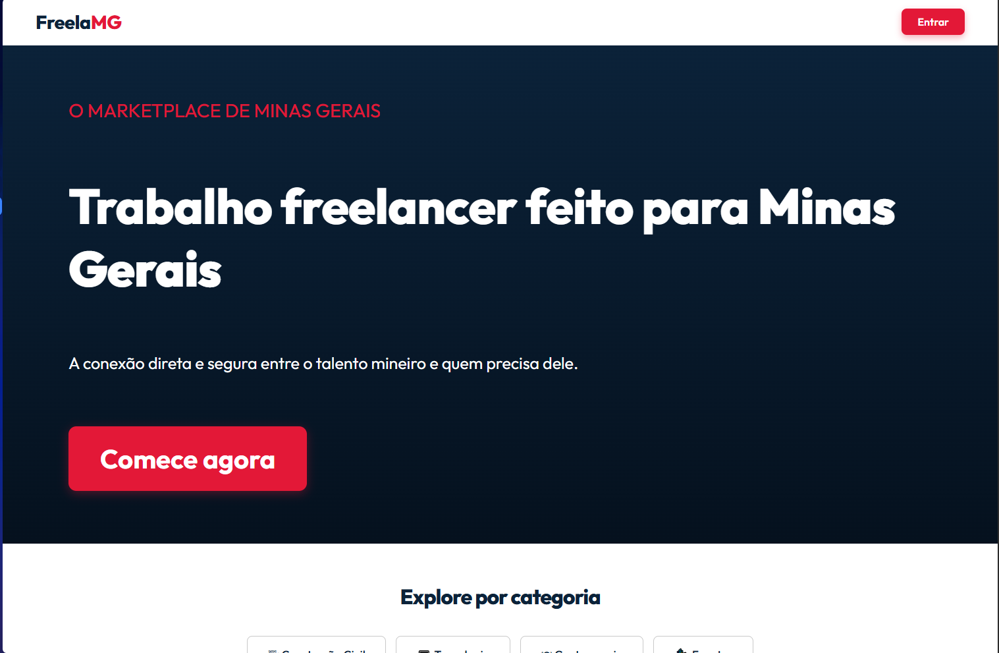 | 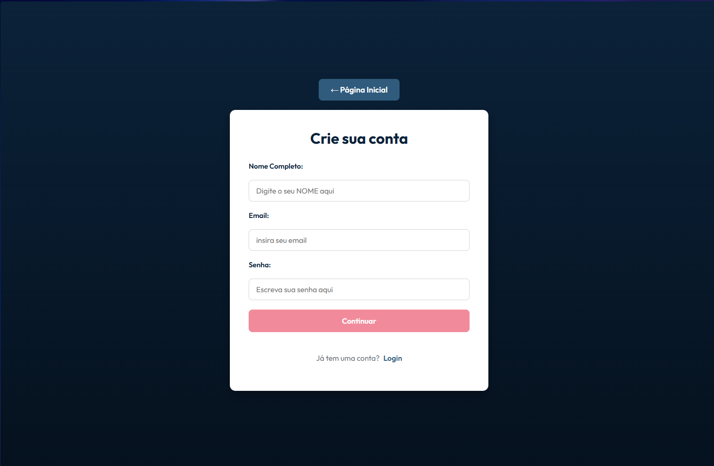 |

### Freelancer Mode

| Find Jobs | My Profile |
| :---: | :---: |
| 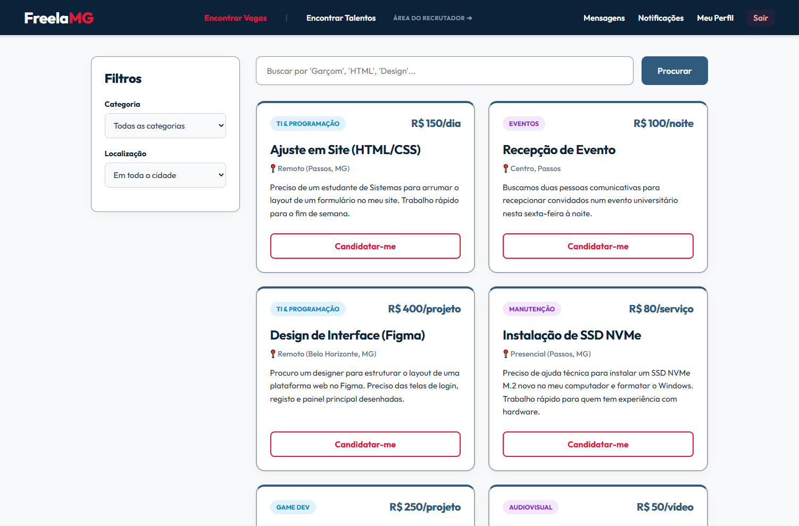 | 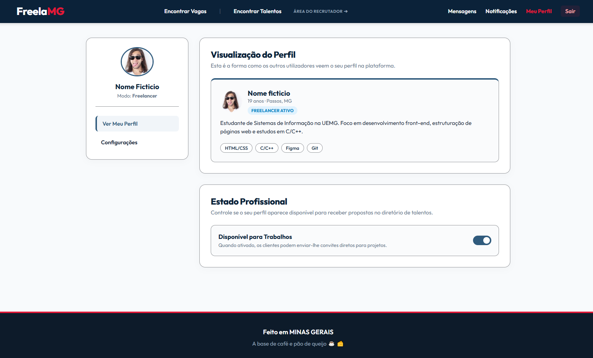 |

| Messages | Notifications |
| :---: | :---: |
| 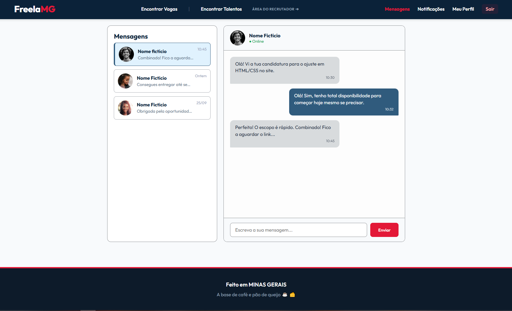 | 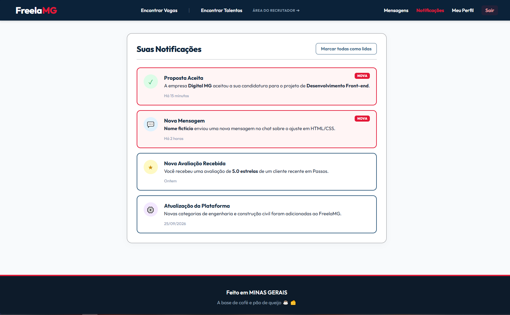 |

### Client Mode (Recruiter Area)

| Post a Job | Manage Applications |
| :---: | :---: |
| 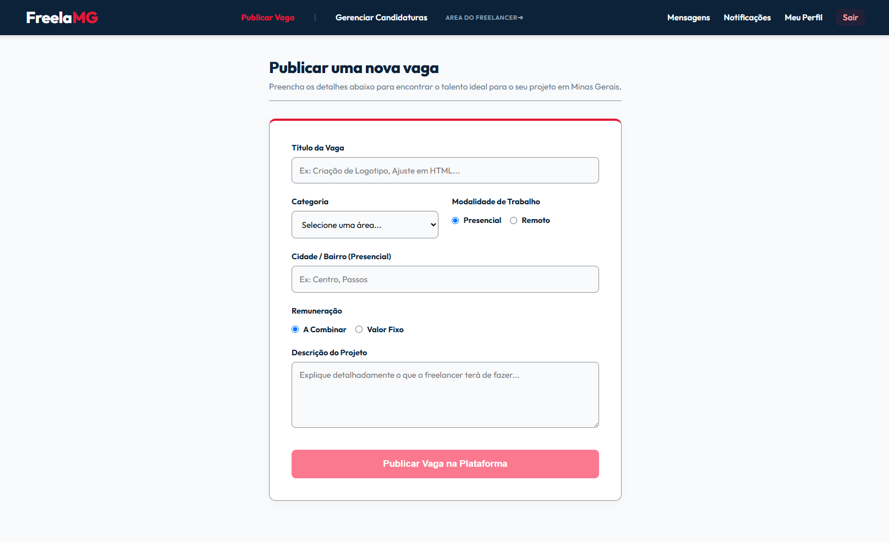 | 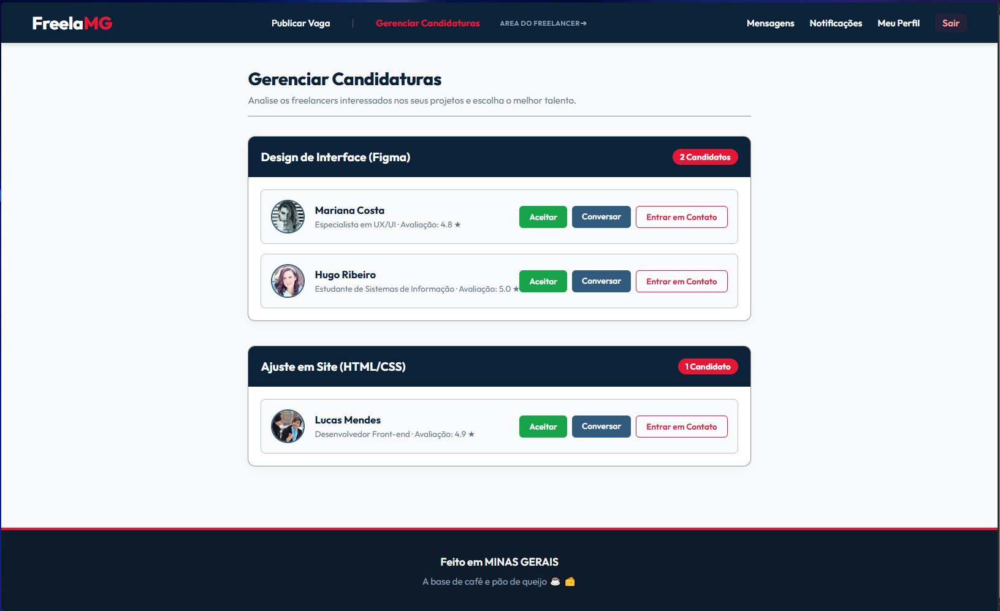 |

| Find Talent |
| :---: |
| 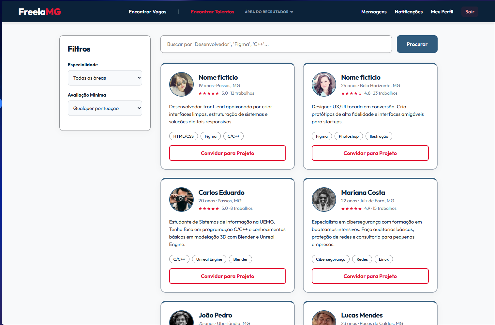 |

<details>
<summary>View other screens</summary>

| Login | Complete Registration |
| :---: | :---: |
| 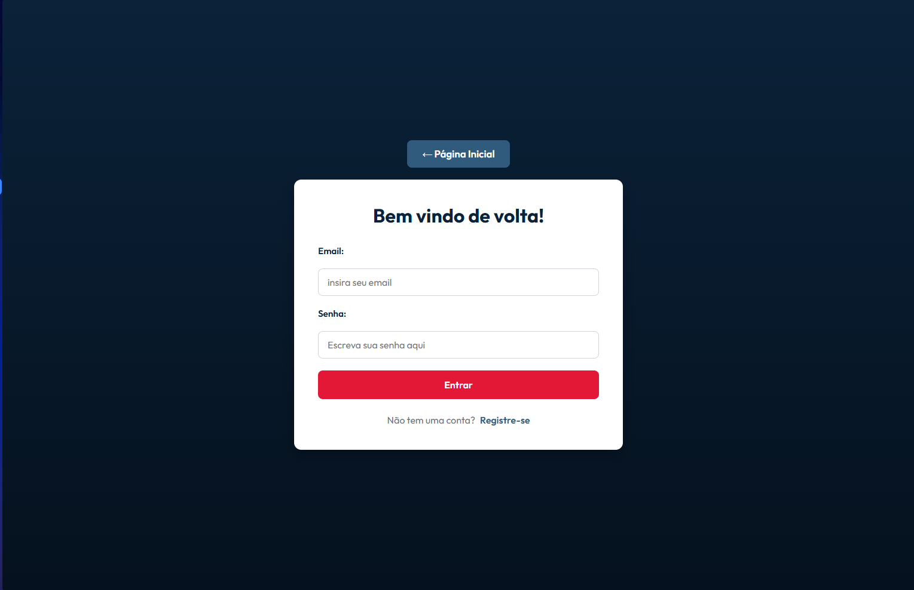 | 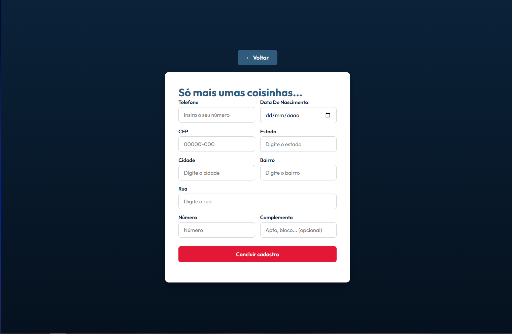 |

| Settings |
| :---: |
| 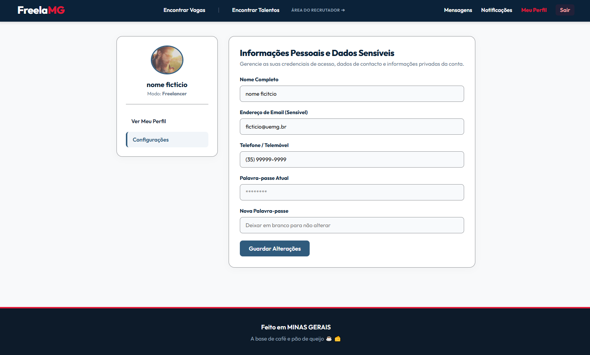 |

</details>

## 📑 Table of Contents

- [Features](#-features)
- [Project Pages](#-project-pages)
- [Technologies](#-technologies)
- [Folder Structure](#-folder-structure)
- [How to Run](#-how-to-run)
- [Technical Highlights](#-technical-highlights)
- [Current Limitations](#-current-limitations)
- [Authors](#-authors)
- [About](#-about)

## ✨ Features

**General**
- Home page featuring the platform presentation, categories, recent jobs, and highlighted freelancers.
- Two-step registration (credentials and profile type selection) and a complementary registration form (phone, birth date, and address).
- Login screen.
- Unified header with navigation, messages, notifications, and profile dropdown menu.
- Responsive layout for smaller screens (768px breakpoint).

**Freelancer Mode**
- Job listings with category and location filters, plus a search bar.
- Apply button available on every job posting.
- Public profile and settings page (personal data and password).
- Availability toggle to receive project invitations.

**Client Mode (Recruiter Area)**
- Job posting form with dynamic fields that adapt to the work model (on-site or remote) and compensation type (fixed or negotiable).
- Application management per job (accept, chat, or contact).
- Talent directory featuring filters by specialty and rating, with direct project invitations.

**Communication**
- Chat interface with a conversation list and message history.
- Notification center with visual cues for new and read items.

## 📄 Project Pages

| Page | File | Description |
| --- | --- | --- |
| Home | `index.html` | Landing page featuring categories, recent jobs, and top freelancers |
| Login | `login.html` | Account access |
| Sign Up | `cadastro.html` | Step 1 (credentials) and Step 2 (freelancer vs. client selection) |
| Complete Registration | `cadastro-completo.html` | Phone, birth date, and address forms |
| Find Jobs | `vagas.html` | Job list with search and filters |
| Find Talent | `talentos.html` | Freelancer directory with search and filters |
| Messages | `mensagens.html` | Chat interface between freelancers and clients |
| Notifications | `notificacoes.html` | Alert and notification center |
| My Profile | `perfil.html` | Public profile view and professional status |
| Settings | `configuracoes.html` | Personal data and account security |
| Post a Job | `publicar-vaga.html` | New job form (client mode) |
| Manage Applications | `gerenciar-candidaturas.html` | Candidate review per job (client mode) |

## 🛠 Technologies

- **HTML5**: Semantic page structure
- **CSS3**: Flexbox, Grid, CSS variables (custom properties), transitions, and media queries
- **[Google Fonts](https://fonts.google.com/specimen/Outfit)**: *Outfit* font family
- **[Pravatar](https://pravatar.cc/)**: Placeholder profile pictures

No external libraries, frameworks, or build steps are required.

## 📁 Folder Structure

```text
freelamg/
├── README.md
├── index.html
├── login.html
├── cadastro.html
├── cadastro-completo.html
├── vagas.html
├── talentos.html
├── mensagens.html
├── notificacoes.html
├── perfil.html
├── configuracoes.html
├── publicar-vaga.html
├── gerenciar-candidaturas.html
├── css/
│   ├── global.css          # variables, internal header, profile dropdown, and footer
│   ├── style.css           # landing page (index.html)
│   ├── cadastro.css        # login, sign up, and complete registration
│   ├── vagas.css           # jobs and talent directories
│   ├── perfil.css          # profile and settings
│   ├── chat.css            # messages
│   ├── notificacoes.css    # notifications
│   └── cliente.css         # post a job and manage applications
└── readme-img/
    └── img/                # screenshots used in this README
```

> The HTML pages reference the styles within the `css/` directory, so please maintain this structure when organizing the repository.

## 🚀 How to Run

No installation is required.

1. Clone the repository:
   ```bash
   git clone https://github.com/HugoDah/freelamg.git
   cd freelamg
   ```
2. Open the `index.html` file in your browser (double-click it or drag it into the browser window).

If you prefer to use a local development server:

```bash
# Using Python
python -m http.server 8000

# Or, in VS Code, use the Live Server extension
```

Then access `http://localhost:8000`.

> An active internet connection is required to load the Outfit font and placeholder images.

**Suggested navigation flow:** `index.html` → `cadastro.html` → `cadastro-completo.html` → `vagas.html`. To explore the client mode, use the **"Recruiter Area ➔"** link in the header.

## 💡 Technical Highlights

The project leverages modern CSS features to deliver interactive elements **without JavaScript**:

- **Multi-step registration:** A hidden `checkbox` combined with the `~` selector toggles between the credentials step and profile selection.
- **Visual validation:** The "Continue" button is disabled while there are invalid fields, achieved using `:has(input:invalid)`.
- **Profile menu:** Dropdown built using native HTML `<details>` and `<summary>` tags.
- **Mode toggle:** The "Mode: Freelancer/Client" text changes according to the switch state via `:has(:checked)`.
- **Dynamic job form:** Location and compensation fields show or hide based on selected `radio` inputs.
- **Publish button:** Changes color when the form is fully valid (`:valid`).
- **Centralized theme:** Colors, borders, shadows, and fonts are defined globally as CSS variables in `global.css`.

## ⚠️ Current Limitations

- Login, registration, and form submissions only **navigate between pages**; no data is sent or stored.
- Search bars, filters, and action buttons (Apply, Accept, Invite to Project, Send Message, Save Changes) are **not functional yet**.
- The Freelancer/Client mode switch is purely visual.
- All displayed content is static and mock data.

## 👥 Authors

- **Hugo Ribeiro Daher**: [@HugoDah](https://github.com/HugoDah)

## 📝 About

This is an academic project developed for study purposes. All rights reserved to the author.

---

<p align="center">Made in Minas Gerais, fueled by coffee and pão de queijo ☕🧀</p>


*Read in English: [readme_.md](readme.md)*

---

# FreelaMG-PTBR

> O marketplace de Minas Gerais: a conexão direta entre o talento mineiro e quem precisa dele.


O **FreelaMG** é uma plataforma web que conecta **freelancers** e **clientes** em Minas Gerais. Quem quer trabalhar encontra vagas e se candidata; quem quer contratar publica projetos, analisa candidaturas e encontra talentos. Tudo isso abrange áreas como tecnologia, construção civil, gastronomia, eventos, saúde, educação, comércio e serviços gerais.

> ⚠️ **Versão inicial (v0.1):** esta versão é um **protótipo de front-end**, feito apenas com HTML e CSS. Não há back-end, banco de dados nem autenticação real. Todos os dados exibidos (nomes, vagas, avaliações, mensagens) são fictícios.

## 📸 Pré-visualização

### Visitante

| Página inicial | Cadastro |
| :---: | :---: |
|  |  |

### Modo Freelancer

| Encontrar vagas | Meu perfil |
| :---: | :---: |
|  |  |

| Mensagens | Notificações |
| :---: | :---: |
|  |  |

### Modo Cliente (Área do recrutador)

| Publicar vaga | Gerenciar candidaturas |
| :---: | :---: |
|  |  |

| Encontrar talentos |
| :---: |
|  |

<details>
<summary>Ver outras telas</summary>

| Login | Cadastro completo |
| :---: | :---: |
|  |  |

| Configurações |
| :---: |
|  |

</details>

## 📑 Sumário

- [Funcionalidades](#-funcionalidades)
- [Páginas do projeto](#-páginas-do-projeto)
- [Tecnologias](#-tecnologias)
- [Estrutura de pastas](#-estrutura-de-pastas)
- [Como executar](#-como-executar)
- [Destaques técnicos](#-destaques-técnicos)
- [Limitações atuais](#-limitações-atuais)
- [Autores](#-autores)
- [Sobre](#-sobre)

## ✨ Funcionalidades

**Geral**
- Página inicial com apresentação da plataforma, categorias, vagas recentes e freelancers em destaque
- Cadastro em duas etapas (dados de acesso e escolha de perfil) e cadastro complementar com telefone, data de nascimento e endereço
- Tela de login
- Cabeçalho unificado com navegação, mensagens, notificações e menu de perfil
- Layout responsivo para telas menores (breakpoint em 768px)

**Modo Freelancer**
- Listagem de vagas com filtros por categoria e localização e barra de busca
- Botão de candidatura em cada vaga
- Perfil público e página de configurações (dados pessoais e senha)
- Controle de disponibilidade para receber convites de projetos

**Modo Cliente (Área do recrutador)**
- Formulário de publicação de vagas, com campos que se adaptam à modalidade (presencial ou remoto) e à remuneração (valor fixo ou a combinar)
- Gerenciamento de candidaturas por vaga (aceitar, conversar ou entrar em contato)
- Diretório de talentos com filtros por especialidade e avaliação, e convite direto para projetos

**Comunicação**
- Chat com lista de conversas e histórico de mensagens
- Central de notificações com destaque visual para itens novos e lidos

## 📄 Páginas do projeto

| Página | Arquivo | Descrição |
| --- | --- | --- |
| Início | `index.html` | Landing page com categorias, vagas recentes e freelancers em destaque |
| Login | `login.html` | Acesso à conta |
| Cadastro | `cadastro.html` | Etapa 1 (credenciais) e etapa 2 (escolha entre freelancer ou cliente) |
| Cadastro completo | `cadastro-completo.html` | Telefone, data de nascimento e endereço |
| Encontrar vagas | `vagas.html` | Lista de vagas com filtros e busca |
| Encontrar talentos | `talentos.html` | Diretório de freelancers com filtros e busca |
| Mensagens | `mensagens.html` | Chat entre freelancers e clientes |
| Notificações | `notificacoes.html` | Central de avisos |
| Meu perfil | `perfil.html` | Visualização do perfil e estado profissional |
| Configurações | `configuracoes.html` | Dados pessoais e segurança da conta |
| Publicar vaga | `publicar-vaga.html` | Formulário de nova vaga (modo cliente) |
| Gerenciar candidaturas | `gerenciar-candidaturas.html` | Análise dos candidatos por vaga (modo cliente) |

## 🛠 Tecnologias

- **HTML5**: estrutura semântica das páginas
- **CSS3**: Flexbox, Grid, variáveis CSS (custom properties), transições e media queries
- **[Google Fonts](https://fonts.google.com/specimen/Outfit)**: fonte *Outfit*
- **[Pravatar](https://pravatar.cc/)**: fotos de perfil de exemplo

Nenhuma biblioteca, framework ou etapa de build é necessária.

## 📁 Estrutura de pastas

```text
freelamg/
├── README.md
├── index.html
├── login.html
├── cadastro.html
├── cadastro-completo.html
├── vagas.html
├── talentos.html
├── mensagens.html
├── notificacoes.html
├── perfil.html
├── configuracoes.html
├── publicar-vaga.html
├── gerenciar-candidaturas.html
├── css/
│   ├── global.css          # variáveis, cabeçalho interno, dropdown de perfil e rodapé
│   ├── style.css           # landing page (index.html)
│   ├── cadastro.css        # login, cadastro e cadastro completo
│   ├── vagas.css           # vagas e talentos
│   ├── perfil.css          # perfil e configurações
│   ├── chat.css            # mensagens
│   ├── notificacoes.css    # notificações
│   └── cliente.css         # publicar vaga e gerenciar candidaturas
└── readme-img/
    └── img/                # capturas de tela usadas neste README
```

> As páginas HTML referenciam os estilos em `css/`, então mantenha essa estrutura ao organizar o repositório.

## 🚀 Como executar

Não é preciso instalar nada.

1. Clone o repositório:
   ```bash
   git clone https://github.com/HugoDah/freelamg.git
   cd freelamg
   ```
2. Abra o arquivo `index.html` no navegador (duplo clique ou arrastando para a janela).

Se preferir usar um servidor local:

```bash
# Com Python
python -m http.server 8000

# Ou, no VS Code, use a extensão Live Server
```

Depois acesse `http://localhost:8000`.

> É necessária conexão com a internet para carregar a fonte Outfit e as fotos de exemplo.

**Fluxo sugerido para navegar:** `index.html` → `cadastro.html` → `cadastro-completo.html` → `vagas.html`. Para conhecer o modo cliente, use o link **"Área do recrutador ➔"** no cabeçalho.

## 💡 Destaques técnicos

O projeto explora recursos modernos de CSS para entregar interações **sem JavaScript**:

- **Cadastro em etapas:** um `checkbox` oculto combinado com o seletor `~` alterna entre a etapa de credenciais e a escolha de perfil.
- **Validação visual:** o botão "Continuar" fica desabilitado enquanto há campos inválidos, usando `:has(input:invalid)`.
- **Menu de perfil:** dropdown construído com `<details>` e `<summary>` nativos.
- **Alternância de modo:** o texto "Modo: Freelancer/Cliente" muda conforme o interruptor, via `:has(:checked)`.
- **Formulário de vaga dinâmico:** os campos de localização e valor aparecem ou somem conforme os `radio` selecionados.
- **Botão de publicar:** muda de cor quando o formulário está válido (`:valid`).
- **Tema centralizado:** cores, bordas, sombras e fontes definidas como variáveis CSS em `global.css`.

## ⚠️ Limitações atuais

- Login, cadastro e formulários apenas **navegam entre páginas**; nenhum dado é enviado ou salvo.
- Busca, filtros e botões (Candidatar-me, Aceitar, Convidar para Projeto, Enviar mensagem, Guardar Alterações) ainda **não têm funcionalidade**.
- O interruptor de modo Freelancer/Cliente é apenas visual.
- Todo o conteúdo é estático e fictício.

## 👥 Autores

- **Hugo Ribeiro Daher**: [@HugoDah](https://github.com/HugoDah)

## 📝 Sobre

Projeto acadêmico desenvolvido para fins de estudo. Todos os direitos reservados ao autor.


---

<p align="center">Feito em Minas Gerais, à base de café e pão de queijo ☕🧀</p>

